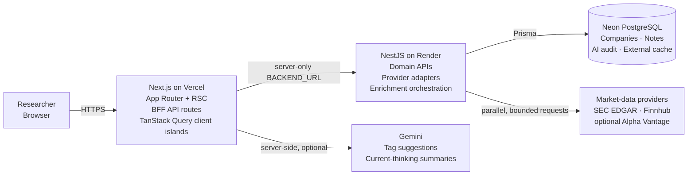

# Thesis Lab

> A thesis-first investment research workspace that turns fragmented company data and research notes into a durable, explainable conviction record.

[Live application](https://thesis-lab-frontend.vercel.app) · [Product requirements](PRD.md) · [Backend health](https://thesis-lab-backend-s8dj.onrender.com/health) · [Editable architecture diagram](docs/architecture/thesis-lab-system-architecture.excalidraw)

## Executive overview

Thesis Lab is a full-stack research notebook for tracking companies, capturing observations, classifying thesis patterns, and synthesizing how an investment view changes over time. It combines structured company data from multiple providers with user-authored research, while keeping provider failures and AI suggestions visible rather than presenting uncertain data as fact.

The project is intentionally designed as a small but production-shaped distributed system:

- Next.js owns rendering, browser-facing API routes, interactive request state, and server-side AI orchestration.
- NestJS owns the domain API, persistence workflows, provider adapters, and enrichment policy.
- PostgreSQL is the durable system of record for companies, notes, AI-audit metadata, and selected external-data cache entries.
- SEC EDGAR, Finnhub, and optional Alpha Vantage data are normalized behind a provider-agnostic aggregation boundary.
- Gemini augments note classification and synthesis, but core research and tagging remain usable when AI is unavailable.

The current deployment is a single-user portfolio project, not a multi-tenant investment platform. That constraint is explicit: authentication and tenant isolation are deliberately deferred, while boundaries for introducing them remain clear.

## What the system does

- Searches and resolves public companies across SEC EDGAR and Finnhub.
- Creates a normalized company record enriched in parallel from multiple sources.
- Tracks conviction, moat patterns, business models, and source provenance.
- Supports note creation, editing, deletion, tagging, and an activity timeline.
- Suggests note tags with Gemini while preserving the user’s final decision for auditability.
- Generates an on-demand “current thinking” summary from bounded note history.
- Exposes partial and failed enrichment states with a user-triggered retry path.
- Keeps dashboard filters in the URL so research views are shareable and restorable.

## System architecture



The Mermaid view renders in GitHub. The editable whiteboard source is available at [`docs/architecture/thesis-lab-system-architecture.excalidraw`](docs/architecture/thesis-lab-system-architecture.excalidraw).

### Responsibility boundaries

| Boundary | Owns | Does not own |
| --- | --- | --- |
| Browser | User intent, URL filters, form drafts, optimistic interaction state | Provider credentials, durable truth, direct third-party calls |
| Next.js / Vercel | Server-rendered reads, browser-facing BFF routes, response-shape validation, AI prompt orchestration | Domain persistence rules or market-data normalization |
| NestJS / Render | Company and note workflows, validation, provider policy, merge semantics, persistence | Presentation state or AI-provider prompts |
| PostgreSQL / Neon | Durable research state, provenance, enrichment status, selected provider cache | Ephemeral UI state and Finnhub’s short-lived search cache |
| External providers | Source data and model inference | Product truth; every response is normalized or validated before use |

This split keeps secrets server-side and prevents the browser from becoming coupled to backend deployment details or third-party response formats. Next.js acts as a backend-for-frontend (BFF), while NestJS remains the reusable application and domain boundary.

## Core request flows

### Search, add, and enrich a company

1. The browser sends a debounced query to a local Next.js API route.
2. Next.js calls the NestJS backend through the server-only `BACKEND_URL`.
3. The backend searches SEC EDGAR and Finnhub concurrently, merges candidates by normalized ticker, and ranks exact/prefix matches.
4. On add, profile adapters run concurrently for SEC EDGAR, Finnhub, and optional Alpha Vantage.
5. The merge layer applies deterministic source precedence and records `COMPLETE`, `PARTIAL`, or `FAILED` rather than failing the whole workflow when one provider degrades.
6. Prisma persists the normalized company, sources used, and enrichment timestamp.

### Read and mutate research

- React Server Components own initial company-list and company-detail reads.
- URL search parameters own dashboard filter state.
- Interactive client islands use TanStack Query for mutation lifecycle, cancellation, optimistic note/conviction updates, and rollback.
- Browser mutations call local `/api/*` handlers; those handlers validate input, translate safe backend errors, and call NestJS.
- NestJS remains the final authority for validation and writes.

This avoids a global client store and avoids turning TanStack Query into a second source of truth for server-rendered pages.

### AI-assisted research

- Tag suggestions send only the current note text to a server-side Next.js route.
- Summary generation fetches the company on the server, caps note history to a character budget, asks Gemini for a synthesis, and persists the accepted result through the backend.
- Prompts prohibit invented figures and investment recommendations.
- Timeouts and graceful fallbacks preserve manual tagging and note workflows when Gemini is missing, rate-limited, or unavailable.
- Suggested tags are stored alongside whether the user changed them, making the assistive workflow auditable.

## Architectural decisions and trade-offs

| Decision | Why it fits now | Trade-off / trigger to evolve |
| --- | --- | --- |
| Next.js as BFF | Keeps backend URLs and AI keys out of the browser; provides one browser-facing error contract | Adds a network hop and some route duplication; introduce generated clients or a typed RPC contract if the API surface grows materially |
| Separate NestJS domain API | Isolates persistence and provider policy from the UI deployment | Two deployables increase operational surface; justified by independent scaling and clearer ownership |
| Provider adapters plus aggregator | Prevents third-party schemas and failure modes from leaking into domain code | Requires normalization tests and explicit source precedence |
| Synchronous enrichment on create/retry | Simple UX and operational model for current traffic | Render cold starts and provider latency affect requests; move enrichment to idempotent background jobs when traffic or latency warrants it |
| Explicit partial success | One degraded provider does not erase useful data or block research | Consumers must understand provenance and incomplete states |
| Mixed cache strategy | Durable SEC directory cache survives restarts; small Finnhub query cache is cheap and fast | In-memory cache and budgets are per-instance; use Redis or another shared coordinator when horizontally scaling |
| Server-side optional AI | Protects credentials and keeps core workflows deterministic and available | AI latency and quota remain user-visible; queue long-running synthesis or add provider fallback only when product demand supports it |
| No authentication in the demo | Keeps the portfolio scope focused on research and integration design | Must add identity, authorization, tenant ownership, and data isolation before real multi-user use |

## Reliability and failure semantics

External APIs are treated as unreliable dependencies, not extensions of the local database:

- Provider requests have five-second timeouts.
- SEC requests are serialized with fair-access headers and conservative request spacing.
- Finnhub uses request pacing, a rolling request budget, and capacity reserved for profile enrichment.
- Alpha Vantage is feature-flagged and protected by a daily budget.
- `Promise.allSettled` isolates adapter failures so one provider cannot reject the entire aggregation operation.
- Provider outcomes are normalized to `ok`, `disabled`, `timeout`, `rate_limited`, or `error`.
- Structured logs capture provider, operation, outcome, status, and latency without logging credentials or research-note content.
- The UI retains notes and displays enrichment provenance/status when upstream data is partial or unavailable.

### Cache behavior

- `ExternalApiCacheEntry` provides a PostgreSQL-backed read-through cache with TTL, upsert-on-refresh, stale-on-failure fallback, and in-flight request coalescing.
- Finnhub search uses a bounded in-memory TTL/LRU cache and coalesces identical in-flight searches.
- Only successful Finnhub responses are cached; provider errors are allowed to recover immediately.

These mechanisms protect provider budgets and improve latency at current scale. They are intentionally not described as globally distributed controls.

## Data model and ownership

| Aggregate | Important state | Ownership rule |
| --- | --- | --- |
| `Company` | Identity, profile, conviction, provenance, enrichment status, current-thinking summary | One normalized record per ticker; backend controls enrichment and summary timestamps |
| `Note` | Research text, moat/business tags, AI suggestions, user-edit audit flag | Belongs to one company and is cascade-deleted with it |
| `ExternalApiCacheEntry` | Source, cache key, JSON payload, fetched/expiry timestamps | Unique per source and key; infrastructure state, not product truth |

Enums make conviction, moat patterns, business models, data sources, and enrichment states explicit across the database and API. The frontend validates backend response shapes with Zod so deployment drift fails visibly at the boundary.

## Security posture

- Market-data and Gemini API keys are read only in server runtimes.
- The browser never receives `BACKEND_URL`; no `NEXT_PUBLIC_*` backend variable is used.
- NestJS validates environment variables at startup and applies whitelist/forbid validation to request DTOs.
- CORS is opt-in and restricted to configured origins for direct backend access.
- Backend errors are translated into a small safe set before they cross the BFF boundary.
- AI prompts are bounded and purpose-specific.

The live demo intentionally has no authentication. That is acceptable only for a single-user portfolio environment with non-sensitive data; it is the first boundary that must change before broader use.

## Deployment and operations

| Component | Platform | Operational concern |
| --- | --- | --- |
| Next.js frontend/BFF | Vercel | Server/runtime environment variables, frontend build, AI calls |
| NestJS API | Render | Cold starts, provider connectivity, request logs, health endpoint |
| PostgreSQL | Neon | Pooled application URL, direct migration URL, schema migrations |
| Market data | SEC EDGAR, Finnhub, Alpha Vantage | Fair-use policy, quotas, latency, schema drift |
| AI | Google Gemini | Key protection, quotas, timeout/fallback behavior |

Production endpoints:

- Frontend: <https://thesis-lab-frontend.vercel.app>
- Backend: <https://thesis-lab-backend-s8dj.onrender.com>
- Health: <https://thesis-lab-backend-s8dj.onrender.com/health>

The health endpoint verifies both process health and database connectivity. Render free-tier cold starts can still delay the first request; that is a hosting characteristic, not an application-level retry signal.

## Quality strategy

- Backend unit tests cover services, controllers, serializers, provider adapters, request schedulers, cache behavior, merge policy, validation, and Prisma error mapping.
- Nest e2e tests exercise the real application bootstrap and health endpoint.
- Frontend Vitest/Testing Library tests cover response schemas, browser fetch behavior, debouncing, AI note-history capping, and interactive controls.
- Production builds validate the NestJS/Prisma and Next.js compilation paths.
- The application is smoke-tested through the deployed Vercel frontend so Vercel → Render → Neon and third-party integration paths are exercised together.

## Evolution path

The next changes are driven by load and product risk, not novelty:

1. Add authentication, user/organization ownership, authorization policy, and tenant-aware database indexes.
2. Move enrichment to an idempotent job model with persisted attempts, exponential backoff, dead-letter handling, and user-visible progress.
3. Replace process-local caches and request budgets with distributed coordination when the backend scales beyond one instance.
4. Add request correlation IDs, provider metrics, traces, dashboards, and SLO-based alerts.
5. Introduce an outbox/event stream if activity feeds, notifications, or downstream analytics need reliable change events.
6. Add contract tests or generated API clients if independent frontend/backend release cadence creates schema-drift risk.

This sequence preserves the current system’s simple operating model while identifying the points where that simplicity stops being safe.

## Repository structure and delivery workflow

The application lives in an npm-workspaces monorepo:

| Path | Purpose |
| --- | --- |
| `frontend/` | Next.js App Router application, BFF routes, AI orchestration, and UI |
| `backend/` | NestJS domain API, Prisma persistence, and company-data adapters |
| `backend/prisma/` | Schema and migrations |
| `docs/architecture/` | Editable system-design artifacts |
| `01-ideas/` → `04-shipped/` | Agent-assisted engineering task pipeline |
| `browser-tasks/` | Standalone external setup tasks |

### Task pipeline

| Folder | Purpose |
| --- | --- |
| `01-ideas/` | Raw ideas, research notes, and rough plans |
| `02-specs/` | Technical approaches, trade-offs, action items, and open questions |
| `03-ready/` | Fully actionable implementation tasks with verification plans |
| `04-shipped/` | Completed work with outcomes and links |

The authoritative workflow, frontmatter convention, and two-model sign-off gate live in [`AGENTS.md`](AGENTS.md). Moving a task from ideas to specs or from specs to ready requires approvals from two genuinely different models. The first model elevates and signs the content; the second independently reviews it, improves it if needed, and moves the file.

Claude Code, Codex, and Cursor expose the same `advance-task` procedure through repository-scoped adapters. Each adapter delegates to `AGENTS.md`; none defines a competing process.

## Local development

Run commands from the repository root. Both applications run on the host; Docker Compose is only used for an optional local PostgreSQL database.

### Prerequisites

- Node.js `24.18.0` (`nvm use` reads `.nvmrc`)
- npm workspaces
- PostgreSQL, either through `compose.yaml` or a configured hosted database

### First-time setup

```bash
nvm use
cp .env.example backend/.env
npm install --legacy-peer-deps
npm run db:generate
```

Choose one database:

```bash
# Option A: local PostgreSQL
docker compose up -d db
npm run db:migrate

# Option B: hosted PostgreSQL
# Set DATABASE_URL and DIRECT_URL in backend/.env, then:
npm run db:migrate
```

For the frontend, set `BACKEND_URL=http://localhost:3001` in `frontend/.env.local`. To point a local frontend at the deployed API, use the Render backend URL instead. Never rename this variable to a `NEXT_PUBLIC_*` value.

### Run both services

```bash
npm run dev
```

- Frontend: <http://localhost:3000>
- Backend: <http://localhost:3001>
- Health check: <http://localhost:3001/health>

### Commands

| Command | Description |
| --- | --- |
| `npm run build` | Production build for both workspaces |
| `npm run lint` | Lint backend and frontend |
| `npm test` | Backend and frontend unit tests |
| `npm run test:e2e` | Backend health e2e tests |
| `npm run db:generate` | Regenerate Prisma Client |
| `npm run db:migrate` | Apply Prisma migrations |
| `npm run db:status` | Check migration status |
